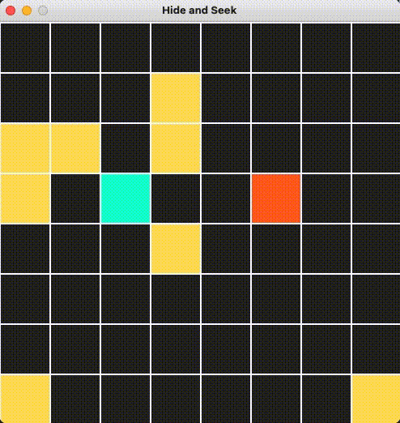

# Hide and Seek! (**Work in Progress**)

## Multi-Agent Reinforcement Learning Algorithm

Two Blobs on a 2D plane, learning to play hide and seek.
There's the seeker (red) and the hider (blue).

## Objective
* Understanding Reinforcement Learning
* Comparing Results between solely training the seeker agent and adversarial training with the hider

## Demo

